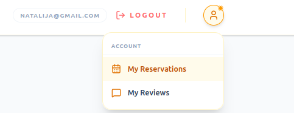
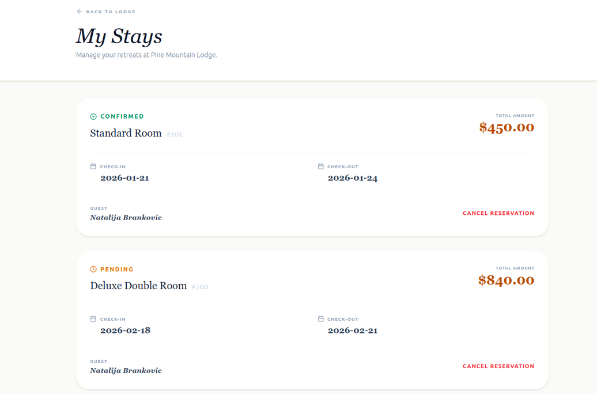
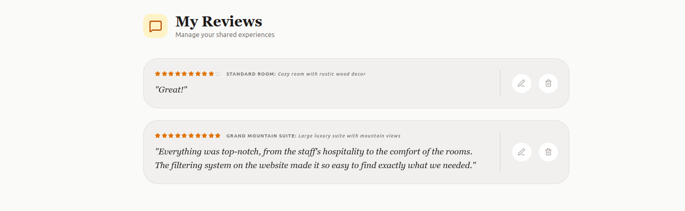
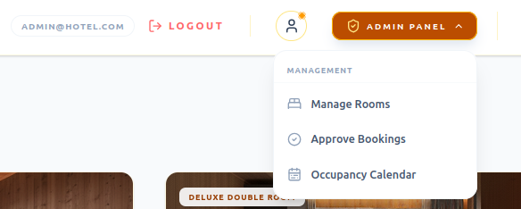
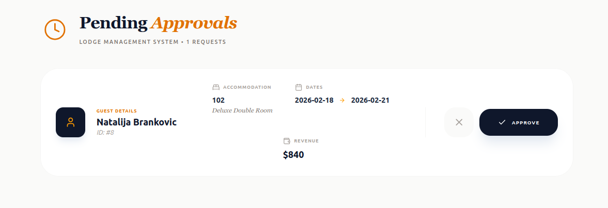

# 🌲 Pine Mountain Lodge - Hotel Reservation System

A full-stack luxury hotel management and reservation platform designed for mountain retreats. This project features a **Spring Boot** backend and a dynamic **React** frontend, providing a seamless experience for both guests and administrators.

---

## 🛠 Tech Stack

**Backend:**
* Java 21 / Spring Boot 4.0.1
* Spring Data JPA
* PostgreSQL
* Liquibase (Database Migrations)
* Spring Security (BCrypt)

**Frontend:**
* React (Vite/TypeScript)
* Tailwind CSS
* Lucide Icons
* Cloudinary (Image Hosting)
---
## 🚀 Getting Started

### 1. Backend Setup
1. Navigate to the `/backend` directory.
2. Configure your `src/main/resources/application.properties` with your PostgreSQL credentials.
3. Run migrations: `mvn liquibase:update`.
4. Start the application: `mvn spring-boot:run`.

### 2. Frontend Setup
1. Navigate to the `/frontend` directory.
2. Install dependencies: `npm install`.
3. Start the development server: `npm run dev`.

### 3. Default Credentials
* **Admin:** `admin@hotel.com` / Password: `admin`
* **User:** `pera@mail.com` / Password: `pera123`

---

## 🛠 Features & User Roles

### 👤 Guest (User) Capabilities
* **Account Management:** Secure registration and login.
* **Search & Discover:** Dynamic room listing based on real-time availability (**Check-in/Check-out dates**).
    * Advanced filtering by **Number of Guests**, **Price Range**, and specific **Amenities** (WiFi, AC, TV, Balcony, etc.).
* **Booking Engine:** Create and manage personal reservations.
    * **My Reservations Page:** A dedicated space to view booking history and cancel existing bookings.
* **Social & Feedback:** Add ratings and detailed comments for completed stays.
    * **My Reviews Page:** Full control over personal feedback with the ability to **view, edit, or delete** past reviews.
    * Browse community reviews from other guests on home page.

### 🔑 Administrator Capabilities
* **Manage Rooms:** Full CRUD control (Create, Read, Update, Delete) over the hotel room inventory.
* **Approve Bookings:** Management of guest reservations with options to confirm or cancel bookings.
* **Occupancy Calendar:** Real-time tracking of all room reservations across the property.
    * Dynamic filtering by Guest Name, Room Number, Status, and Date Range.

---

## 📊 Database Schema

The system architecture is built on a relational PostgreSQL database with the following entities:

* **Users & Security:** `Role` (RBAC), `User` (Profile & Auth).
* **Property & Rooms:** `Property` (Lodge details), `RoomType` (Capacity), `Room` (Specific inventory).
* **Amenities:** `Amenity` & `Room_Amenity` (Many-to-Many mapping for room features).
* **Business Logic:** `Reservation` (Booking details & status), `Review` (User feedback linked to stays).

---

## 🚀 Features & Walkthrough

### Home Page
Displays the room list and integrated guest reviews.

   <video src="https://github.com/user-attachments/assets/eb59d6e3-f488-4246-887a-7aef58a41ac1" width="100%" autoplay loop muted playsinline></video>

### Room Selection & Filtering
The main page allows users to view detailed room descriptions and filter available rooms by:
* Check in and check out dates
* Capacity
* Price per night
* Room amenities

    

### Authentication & Booking
Booking requires user registration and login. Once authenticated, users can access the reservation system for selected rooms.

  <video src="https://github.com/user-attachments/assets/6891b9ed-0339-43e9-bda8-0c4aa7c959fd" width="49%" autoplay loop muted playsinline></video>
  <video src="https://github.com/user-attachments/assets/534c327f-b6c9-4e0f-91d3-61fc0c3eb573" width="49%" autoplay loop muted playsinline></video>

---

### User Dashboard
Registered users can manage their activity through a dedicated menu:

* **My Reservations:** Tracking of current and past bookings.
  
    
* **My Reviews:** Overview and management of submitted feedback.
  
    

---

### Admin Panel
Administrative interface for system management:

* **Manage Rooms:** Dedicted page for adding and updating room data.
  
 
    
* **Approve Bookings:** Module for reviewing and confirming pending reservations.
  
    
    
* **Occupancy Calendar:** Visual overview of all bookings with filters for guest name, room number, status, and date range.

